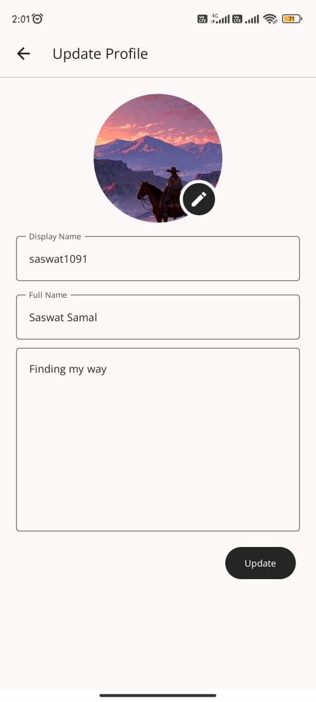
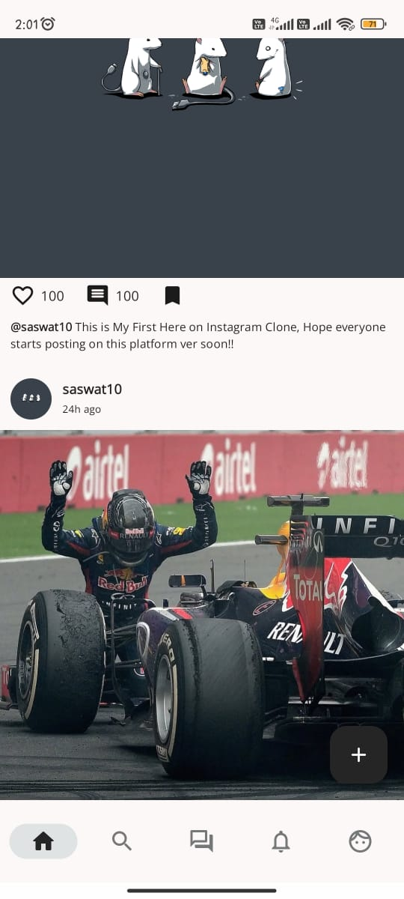
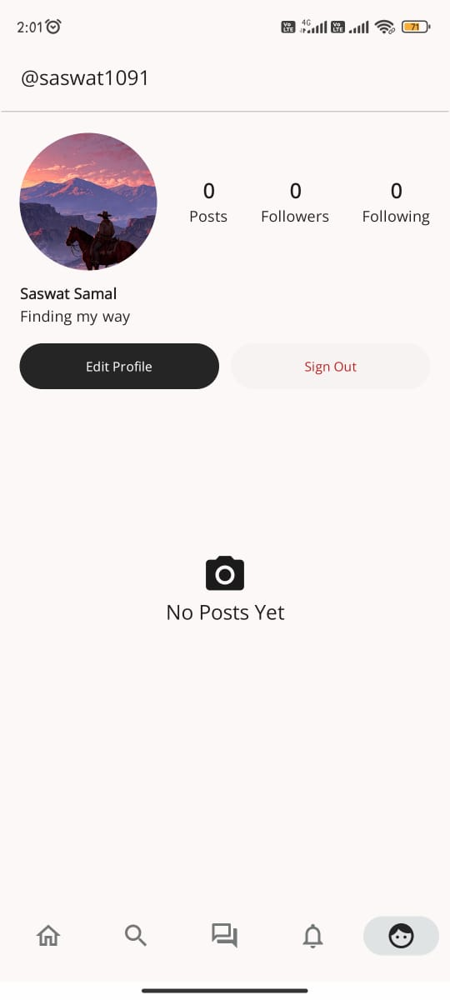

# JETGRAM - Social Media and Chat Application

> Currently under development
> - Tech stack used is Kotlin and Jetpack Compose
> - Firebase Authentication, Firestore, and Cloudinary are used
> - CRUD operations on Users, Posts, Comments

## Initial Screenshots

|Update Profile Screen|User Feed Screen|User Profile Screen|
|------------|-------------|------------|
||  ||

## Todo

- [ ] Chat Capabilities
- [ ] Realtime Database Implementation
- [ ] Exoplayer Integration for Video Files
- [ ] Work Manager for Large Video Uploads